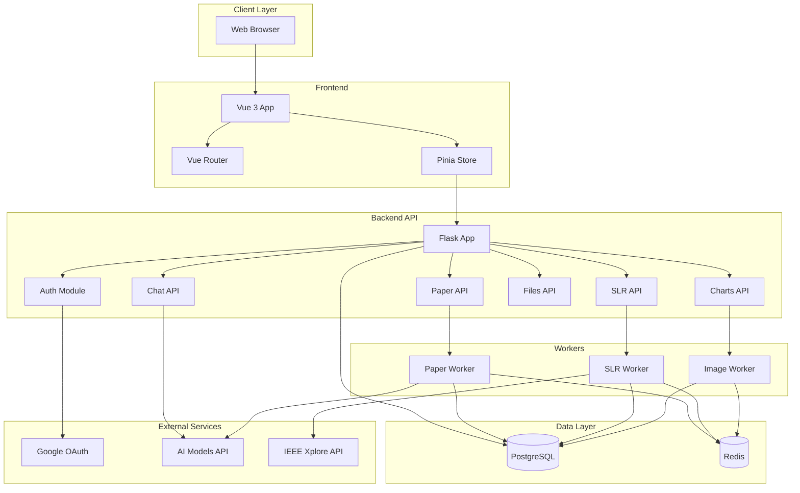
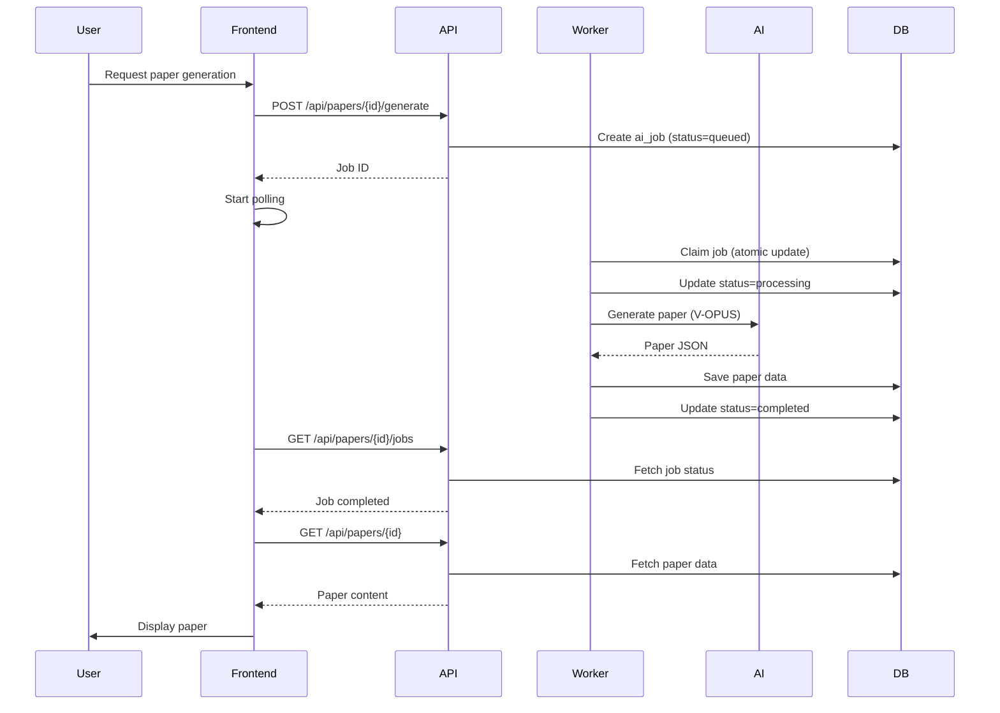
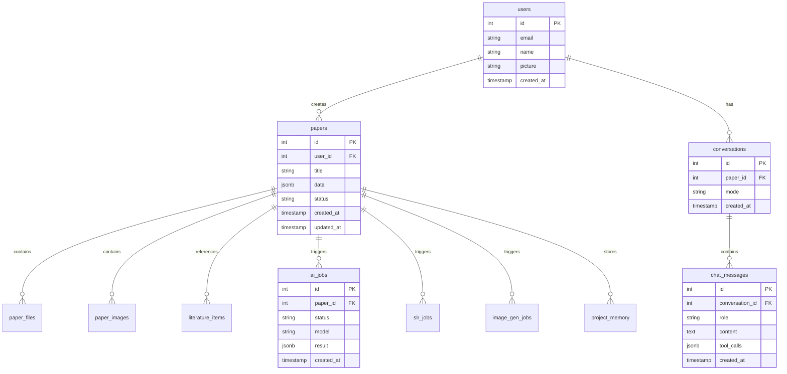
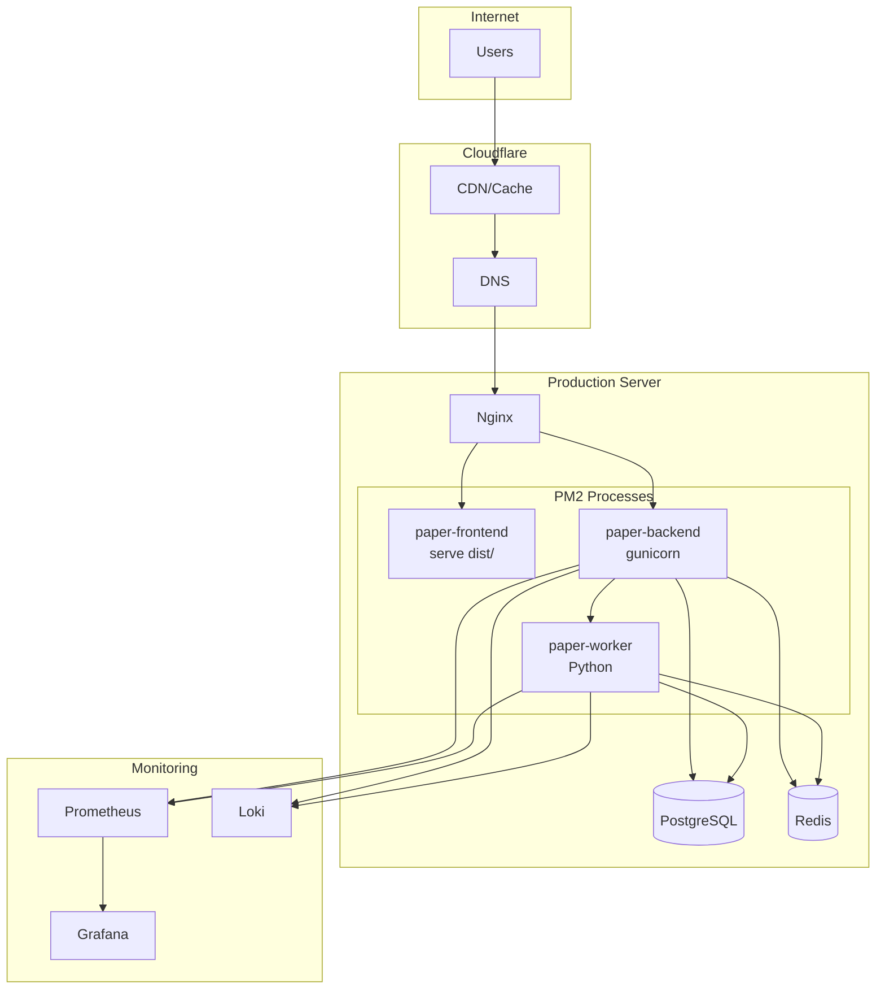
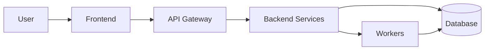
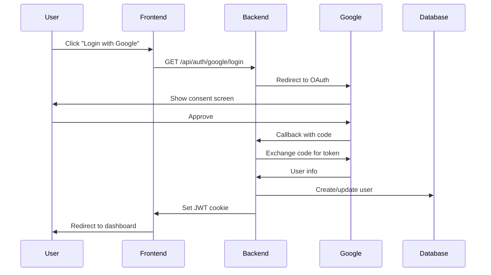
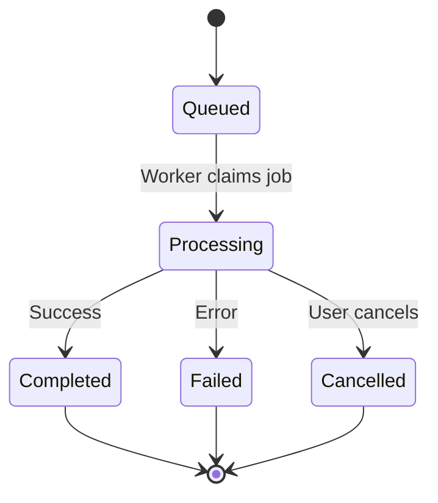
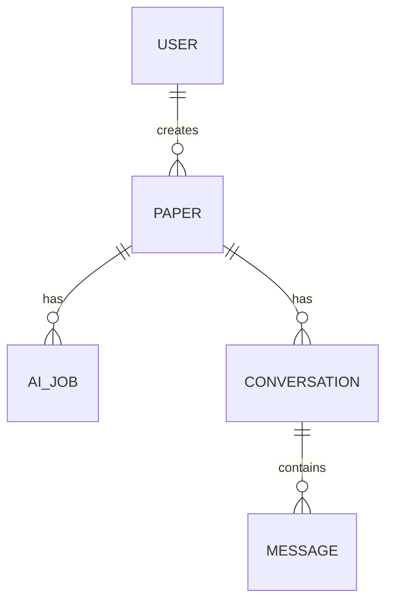

# Documentation Structure and Architecture Plan
**Project:** PaperFull (papergenerator)  
**Date:** 2026-05-22  
**Status:** Planning Phase

---

## Executive Summary

This document outlines a comprehensive documentation strategy for the PaperFull application. Current documentation is scattered across HANDOFF files, LAPORAN reports, and workflow specs. This plan establishes a structured, maintainable documentation system covering architecture, development, deployment, and features.

**Current State:**
- ✅ Implementation handoffs (HANDOFF_*.md)
- ✅ Work reports (LAPORAN_*.md)
- ✅ Workflow framework (worflowQuestion.md)
- ✅ Playwright test docs (backend/tests/README_PLAYWRIGHT_TESTS.md)
- ✅ OpenAPI spec (docs/api/openapi.yaml)
- ❌ Architecture documentation
- ❌ Developer onboarding guide
- ❌ Deployment guide
- ❌ Troubleshooting guide
- ❌ Feature documentation

---

## 1. Proposed Documentation Structure

```
docs/
├── README.md                           # Documentation index & navigation
│
├── architecture/
│   ├── README.md                       # Architecture overview
│   ├── system-overview.md              # High-level system design
│   ├── component-diagram.md            # Component interactions (Mermaid)
│   ├── data-flow.md                    # Data flow diagrams
│   ├── database-schema.md              # DB schema & relationships
│   ├── deployment-architecture.md      # Production deployment setup
│   ├── tech-stack.md                   # Technology choices & rationale
│   └── decision-records/               # Architecture Decision Records (ADRs)
│       ├── 001-model-lock.md
│       ├── 002-single-shot-generation.md
│       └── template.md
│
├── api/
│   ├── README.md                       # API documentation index
│   ├── openapi.yaml                    # OpenAPI 3.0 spec (existing)
│   ├── authentication.md               # OAuth & JWT flow
│   ├── chat-api.md                     # Chat endpoints
│   ├── paper-api.md                    # Paper generation endpoints
│   ├── slr-api.md                      # SLR endpoints
│   ├── files-api.md                    # File upload endpoints
│   ├── charts-api.md                   # Chart generation endpoints
│   ├── rate-limits.md                  # Rate limiting & quotas
│   └── webhooks.md                     # Webhook events (if any)
│
├── development/
│   ├── README.md                       # Development guide index
│   ├── quick-start.md                  # Get started in 5 minutes
│   ├── setup.md                        # Detailed setup instructions
│   ├── project-structure.md            # Codebase organization
│   ├── coding-standards.md             # Code style & conventions
│   ├── testing.md                      # Testing strategy & running tests
│   ├── debugging.md                    # Debugging tips & tools
│   ├── contributing.md                 # Contribution guidelines
│   ├── git-workflow.md                 # Branching & PR process
│   └── local-development.md            # Running locally with hot reload
│
├── deployment/
│   ├── README.md                       # Deployment guide index
│   ├── production-setup.md             # Production server setup
│   ├── environment-variables.md        # All env vars documented
│   ├── database-migrations.md          # Alembic migration guide
│   ├── monitoring.md                   # Prometheus/Grafana setup
│   ├── backup-restore.md               # Backup & restore procedures
│   ├── scaling.md                      # Horizontal/vertical scaling
│   ├── security.md                     # Security best practices
│   └── ci-cd.md                        # CI/CD pipeline setup
│
├── features/
│   ├── README.md                       # Feature documentation index
│   ├── paper-generation.md             # Paper generation workflow
│   ├── slr-workflow.md                 # Systematic Literature Review
│   ├── chat-interface.md               # Chat & AI interaction
│   ├── multi-question.md               # Multi-question workflow
│   ├── file-uploads.md                 # File upload & classification
│   ├── image-generation.md             # Image generation workflow
│   ├── chart-generation.md             # Chart generation
│   ├── citation-management.md          # Citation styles & management
│   └── export-formats.md               # DOCX/PDF export
│
├── troubleshooting/
│   ├── README.md                       # Troubleshooting index
│   ├── common-issues.md                # FAQ & common problems
│   ├── error-codes.md                  # Error code reference
│   ├── performance.md                  # Performance issues
│   ├── database-issues.md              # DB-related problems
│   ├── worker-issues.md                # Worker/queue problems
│   └── production-incidents.md         # Incident response playbook
│
├── operations/
│   ├── README.md                       # Operations guide index
│   ├── monitoring-alerts.md            # Alert definitions & responses
│   ├── log-analysis.md                 # Log locations & analysis
│   ├── health-checks.md                # Health check endpoints
│   └── runbooks/                       # Operational runbooks
│       ├── restart-services.md
│       ├── database-recovery.md
│       └── worker-stuck.md
│
└── reference/
    ├── README.md                       # Reference documentation index
    ├── model-configuration.md          # AI model settings
    ├── prompt-engineering.md           # Prompt templates & design
    ├── tool-registry.md                # Chat tools documentation
    └── glossary.md                     # Terms & definitions
```

---

## 2. Architecture Documentation Outline

### 2.1 System Overview (`architecture/system-overview.md`)

```markdown
# System Overview

## Introduction
PaperFull is an AI-powered academic paper generation platform...

## High-Level Architecture
[Mermaid diagram: Client → API Gateway → Backend Services → Workers → Database]

## Core Components
- **Frontend**: Vue 3 SPA
- **Backend API**: Flask REST API
- **Workers**: Async task processors (paper, SLR, image)
- **Database**: PostgreSQL
- **Cache/Queue**: Redis
- **AI Services**: V-OPUS, V-DEEPSEEK models

## Key Workflows
1. User authentication (Google OAuth)
2. Paper generation (single-shot)
3. SLR execution
4. Chat interaction
5. Image generation

## Technology Stack
[Link to tech-stack.md]
```

### 2.2 Component Diagram (`architecture/component-diagram.md`)

```markdown
# Component Interaction Diagram

## System Components



## Component Responsibilities
[Detailed description of each component]
```

### 2.3 Data Flow Diagram (`architecture/data-flow.md`)

```markdown
# Data Flow Diagrams

## Paper Generation Flow



## SLR Flow
[Similar sequence diagram for SLR]

## Chat Flow
[Similar sequence diagram for chat]
```

### 2.4 Database Schema (`architecture/database-schema.md`)

```markdown
# Database Schema

## Entity Relationship Diagram



## Table Descriptions
[Detailed description of each table]

## Indexes
[List of indexes and their purpose]

## Migrations
[Link to migration guide]
```

### 2.5 Deployment Architecture (`architecture/deployment-architecture.md`)

```markdown
# Deployment Architecture

## Production Setup



## Infrastructure Components
- **Domain**: paperfull.app
- **CDN**: Cloudflare
- **Web Server**: Nginx (reverse proxy)
- **Process Manager**: PM2
- **Database**: PostgreSQL 14+
- **Cache/Queue**: Redis 7+
- **Monitoring**: Prometheus + Grafana + Loki

## Resource Requirements
[CPU, RAM, disk requirements]

## Scaling Strategy
[Horizontal/vertical scaling approach]
```

---

## 3. Developer Guide Outline

### 3.1 Quick Start (`development/quick-start.md`)

```markdown
# Quick Start Guide

Get PaperFull running locally in 5 minutes.

## Prerequisites
- Python 3.10+
- Node.js 18+
- PostgreSQL 14+
- Redis 7+

## Setup Steps

### 1. Clone Repository
```bash
git clone https://github.com/yourusername/papergenerator.git
cd papergenerator
```

### 2. Backend Setup
```bash
cd backend
python3 -m venv .venv
source .venv/bin/activate
pip install -r requirements.txt
cp .env.example .env
# Edit .env with your credentials
alembic upgrade head
```

### 3. Frontend Setup
```bash
cd frontend
npm install
cp .env.example .env
# Edit .env if needed
```

### 4. Start Services
```bash
# Terminal 1: Backend
cd backend && flask run

# Terminal 2: Worker
cd backend && python worker.py

# Terminal 3: Frontend
cd frontend && npm run dev
```

### 5. Access Application
Open http://localhost:5173

## Next Steps
- [Detailed Setup Guide](setup.md)
- [Project Structure](project-structure.md)
- [Testing Guide](testing.md)
```

### 3.2 Testing Guide (`development/testing.md`)

```markdown
# Testing Guide

## Test Structure
```
backend/tests/
├── conftest.py                 # Pytest fixtures
├── test_chat_tools.py          # Chat tools tests
├── test_generate_paper_*.py    # Paper generation tests
├── test_slr_*.py               # SLR tests
└── test_playwright_*.py        # E2E tests
```

## Running Tests

### Backend Unit Tests
```bash
cd backend
PYTEST_DISABLE_PLUGIN_AUTOLOAD=1 python3 -m pytest tests/ -v
```

### Frontend Tests
```bash
cd frontend
npm run test
```

### E2E Tests
```bash
cd frontend
npm run test:e2e
```

## Writing Tests
[Guidelines for writing tests]

## Test Coverage
[Coverage requirements and tools]
```

### 3.3 Debugging Guide (`development/debugging.md`)

```markdown
# Debugging Guide

## Backend Debugging

### Enable Debug Mode
```bash
export FLASK_DEBUG=1
flask run
```

### View Logs
```bash
tail -f backend/app.log
```

### Database Queries
```bash
# Connect to PostgreSQL
psql $DATABASE_URL

# View tables
\dt

# Query example
SELECT * FROM papers WHERE user_id = 1;
```

## Frontend Debugging

### Vue DevTools
Install Vue DevTools browser extension

### Console Logging
```javascript
console.log('[DEBUG]', data)
```

### Network Inspection
Use browser DevTools Network tab

## Common Issues
[Link to troubleshooting guide]
```

---

## 4. Documentation Templates

### 4.1 Feature Documentation Template

```markdown
# Feature Name

## Overview
Brief description of the feature.

## User Flow
Step-by-step user journey.

## Technical Implementation
How it works under the hood.

## API Endpoints
Related API endpoints.

## Configuration
Environment variables and settings.

## Examples
Code examples and screenshots.

## Troubleshooting
Common issues and solutions.

## Related Features
Links to related documentation.
```

### 4.2 Architecture Decision Record (ADR) Template

```markdown
# ADR-XXX: Title

**Status:** [Proposed | Accepted | Deprecated | Superseded]  
**Date:** YYYY-MM-DD  
**Deciders:** [Names]

## Context
What is the issue we're facing?

## Decision
What decision did we make?

## Rationale
Why did we make this decision?

## Consequences
What are the positive and negative consequences?

## Alternatives Considered
What other options did we consider?

## References
Links to related discussions, PRs, issues.
```

### 4.3 API Endpoint Documentation Template

```markdown
# Endpoint Name

## Endpoint
`METHOD /api/path`

## Description
What this endpoint does.

## Authentication
Required authentication method.

## Request

### Headers
```json
{
  "Authorization": "Bearer <token>",
  "Content-Type": "application/json"
}
```

### Parameters
| Name | Type | Required | Description |
|------|------|----------|-------------|
| param1 | string | Yes | Description |

### Body
```json
{
  "field": "value"
}
```

## Response

### Success (200)
```json
{
  "status": "success",
  "data": {}
}
```

### Error (4xx/5xx)
```json
{
  "error": "Error message"
}
```

## Examples

### cURL
```bash
curl -X POST https://paperfull.app/api/endpoint \
  -H "Authorization: Bearer token" \
  -d '{"field": "value"}'
```

### JavaScript
```javascript
const response = await fetch('/api/endpoint', {
  method: 'POST',
  headers: {
    'Authorization': 'Bearer token',
    'Content-Type': 'application/json'
  },
  body: JSON.stringify({ field: 'value' })
})
```

## Rate Limits
Rate limit information.

## Related Endpoints
Links to related endpoints.
```

---

## 5. Mermaid Diagram Examples

### 5.1 System Architecture


### 5.2 Authentication Flow


### 5.3 Paper Generation State Machine


### 5.4 Database Schema (Simplified)


---

## 6. Documentation Maintenance Plan

### 6.1 Ownership
| Documentation Area | Owner | Reviewer |
|-------------------|-------|----------|
| Architecture | Tech Lead | Team |
| API | Backend Team | Frontend Team |
| Development | All Developers | Tech Lead |
| Deployment | DevOps | Tech Lead |
| Features | Product + Dev | All |

### 6.2 Update Triggers
Documentation must be updated when:
- ✅ New feature is added
- ✅ API endpoint changes
- ✅ Architecture decision is made
- ✅ Deployment process changes
- ✅ Bug fix affects documented behavior
- ✅ Configuration changes

### 6.3 Review Process
1. Documentation changes included in PR
2. Reviewer checks docs accuracy
3. Docs merged with code changes
4. Quarterly documentation audit

### 6.4 Documentation Standards
- Use Markdown for all docs
- Use Mermaid for diagrams
- Keep examples up-to-date
- Include code snippets
- Link related documents
- Version control everything

### 6.5 Tools
- **Editor**: Any Markdown editor
- **Diagrams**: Mermaid (in Markdown)
- **API Spec**: OpenAPI 3.0
- **Hosting**: Git repository (GitHub/GitLab)
- **Preview**: MkDocs or Docusaurus (optional)

---

## 7. Priority Order for Writing Documentation

### Phase 1: Critical (Week 1) 🔴
**Goal**: Enable new developers to start contributing

1. **development/quick-start.md** - Get running in 5 minutes
2. **development/setup.md** - Detailed setup instructions
3. **development/project-structure.md** - Understand codebase layout
4. **architecture/system-overview.md** - High-level understanding
5. **architecture/tech-stack.md** - Technology choices

**Deliverable**: New developer can set up and understand the system

### Phase 2: Important (Week 2) 🟡
**Goal**: Enable development and deployment

6. **architecture/component-diagram.md** - Component interactions
7. **architecture/data-flow.md** - Key workflows
8. **architecture/database-schema.md** - Database structure
9. **development/testing.md** - Run and write tests
10. **deployment/production-setup.md** - Deploy to production
11. **deployment/environment-variables.md** - All env vars documented

**Deliverable**: Team can develop features and deploy safely

### Phase 3: Operational (Week 3) 🟢
**Goal**: Enable operations and troubleshooting

12. **troubleshooting/common-issues.md** - FAQ
13. **troubleshooting/error-codes.md** - Error reference
14. **operations/monitoring-alerts.md** - Alert responses
15. **operations/runbooks/** - Operational procedures
16. **deployment/backup-restore.md** - Backup procedures

**Deliverable**: Team can operate and troubleshoot production

### Phase 4: Feature Documentation (Week 4) 🔵
**Goal**: Document all features

17. **features/paper-generation.md** - Core feature
18. **features/slr-workflow.md** - SLR feature
19. **features/chat-interface.md** - Chat feature
20. **features/multi-question.md** - Multi-question workflow
21. **features/** - All other features

**Deliverable**: All features documented

### Phase 5: API Documentation (Week 5) 📘
**Goal**: Complete API documentation

22. **api/authentication.md** - Auth flow
23. **api/chat-api.md** - Chat endpoints
24. **api/paper-api.md** - Paper endpoints
25. **api/slr-api.md** - SLR endpoints
26. **api/** - All other endpoints

**Deliverable**: Complete API reference

### Phase 6: Polish (Week 6) ✨
**Goal**: Complete and polish documentation

27. **architecture/deployment-architecture.md** - Deployment details
28. **architecture/decision-records/** - ADRs for key decisions
29. **reference/** - Reference documentation
30. **docs/README.md** - Documentation index

**Deliverable**: Complete, polished documentation set

---

## 8. Success Metrics

### Documentation Quality Metrics
- ✅ All critical paths documented
- ✅ New developer onboarding time < 1 day
- ✅ Documentation coverage > 80%
- ✅ Docs updated within 1 week of code changes
- ✅ Zero "undocumented" labels in issues

### User Metrics
- ✅ Reduced "how do I..." questions
- ✅ Faster PR reviews (clear context)
- ✅ Fewer production incidents (better runbooks)
- ✅ Positive developer feedback

---

## 9. Next Steps

### Immediate Actions
1. ✅ Review and approve this plan
2. ⏳ Create documentation directory structure
3. ⏳ Write Phase 1 critical documentation
4. ⏳ Set up documentation review process
5. ⏳ Add documentation checklist to PR template

### Long-term Actions
- Consider documentation hosting (MkDocs/Docusaurus)
- Set up automated documentation testing
- Create video tutorials for complex features
- Translate documentation to Indonesian
- Build interactive API playground

---

## 10. Appendix

### A. Existing Documentation Audit

| File | Type | Quality | Action |
|------|------|---------|--------|
| HANDOFF_*.md | Implementation | Good | Archive to docs/archive/ |
| LAPORAN_*.md | Report | Good | Archive to docs/archive/ |
| worflowQuestion.md | Spec | Excellent | Move to docs/features/ |
| backend/tests/README_PLAYWRIGHT_TESTS.md | Testing | Good | Move to docs/development/ |
| docs/api/openapi.yaml | API Spec | Good | Keep, expand |

### B. Documentation Tools Comparison

| Tool | Pros | Cons | Recommendation |
|------|------|------|----------------|
| Plain Markdown | Simple, version controlled | No search, no hosting | ✅ Start here |
| MkDocs | Easy, Python-based | Limited features | Consider later |
| Docusaurus | Feature-rich, React-based | Complex setup | Consider later |
| GitBook | Beautiful, hosted | Paid for private | Not recommended |

### C. Mermaid Diagram Types

- **Flowchart**: System architecture, workflows
- **Sequence Diagram**: API flows, interactions
- **State Diagram**: State machines, job lifecycle
- **ER Diagram**: Database schema
- **Gantt Chart**: Project timeline (optional)
- **Class Diagram**: Code structure (optional)

---

**End of Documentation Plan**

**Prepared by**: Kilo AI  
**Review Status**: Pending  
**Next Review**: After Phase 1 completion
