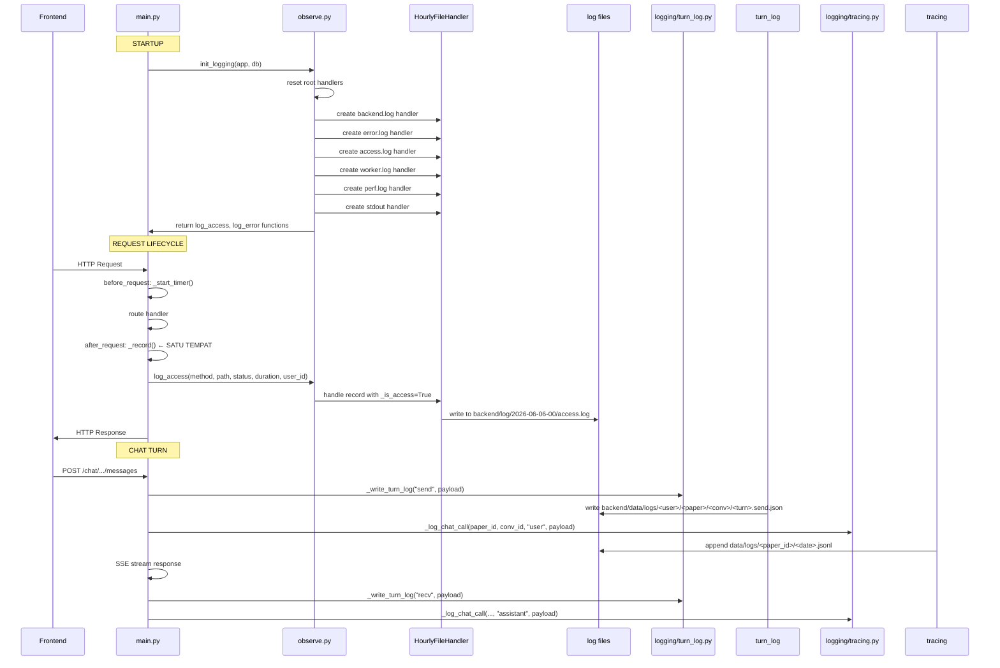

# Refactoring Plan: Chat System

## 1. Struktur Direktori Baru

```
backend/tools/chat/
├── __init__.py                    # Public exports (CHAT_MODEL, register_active_job, dll)
├── routes/
│   ├── __init__.py
│   ├── conversations.py            # CRUD conversations (from chat_api)
│   ├── messages.py                 # SSE streaming endpoint (from chat_api)
│   ├── memory.py                   # ProjectMemory CRUD (from chat_api)
│   └── papers.py                   # Chat paper listing (from chat_api)
├── core/
│   ├── __init__.py
│   ├── stream.py                   # SSE generator, _StreamScrubber, _call_upstream
│   ├── messages_builder.py         # _build_messages, memory injection
│   ├── mode_router.py              # _resolve_mode, _set_mode, tool selection
│   └── safe_errors.py              # _safe_user_error, control token scrubbing
├── tools/
│   ├── __init__.py
│   ├── executor.py                 # execute_tool, _dispatch_tool (from tools.py)
│   ├── search.py                   # _web_search, _web_fetch, _search_papers
│   ├── literature.py               # _run_slr_tool, _get_literature_tool
│   ├── paper_ops.py                # _get_paper_content/section/numbering
│   ├── generation.py               # _generate_full_paper, _plan_outline
│   ├── proposals.py                # _propose, _propose_revisi helpers
│   └── memory.py                   # _list_memory, _delete_memory, _save_memory
├── workflow/
│   ├── __init__.py
│   ├── engine.py                   # WORKFLOW_PHASES, phase questions (from engine.py)
│   ├── state.py                    # _get/save workflow state (from tool.py)
│   ├── suggestions.py              # _generate_phase2_suggestions
│   └── validation.py               # validate_workflow (from engine.py)
├── models/
│   ├── __init__.py
│   ├── schemas.py                  # Chat-specific Pydantic/schema models
│   └── dataclasses.py             # ExtractedFact, _ParsedAssistant dkk
├── extraction/
│   ├── __init__.py
│   └── auto_memory.py              # extract_facts, regex/LLM parsers (from auto_memory.py)
├── logging/
│   ├── __init__.py
│   ├── turn_log.py                 # Per-turn JSON logging (from chat_api)
│   ├── tracing.py                  # _log_chat_call → unified JSONL tracing
│   └── user_storage.py             # save_chat_send/recv calls
└── prompts/
    ├── __init__.py
    └── modes.py                    # MODE_PROMPTS + MODE_TOOLS (from mode_prompts.py)
```

## 2. File Mapping (Old → New)

| File Lama | File Baru | Catatan |
|-----------|-----------|---------|
| `tools/chat/chat_api.py` (1280 baris) | `routes/conversations.py` | Route: `GET/POST/PATCH/DELETE` conversations |
| | `routes/messages.py` | Route: `POST .../messages` → SSE stream |
| | `routes/memory.py` | Route: `GET/DELETE` ProjectMemory |
| | `routes/papers.py` | Route: `GET /api/chat/papers` |
| | `core/stream.py` | `_call_upstream`, `_StreamScrubber`, `generate()` |
| | `core/messages_builder.py` | `_build_messages`, memory/paper injection |
| | `core/mode_router.py` | `_resolve_mode`, `_set_mode`, `_select_tools` |
| | `core/safe_errors.py` | `_safe_user_error`, `_scrub_control_tokens` |
| | `logging/turn_log.py` | `_turn_log_dir`, `_write_turn_log` |
| | `logging/user_storage.py` | save_chat_send/recv calls |
| `tools/chat/tools.py` (1700+ baris) | `tools/executor.py` | `execute_tool`, `_dispatch_tool` |
| | `tools/search.py` | Web search, paper search |
| | `tools/literature.py` | SLR tools |
| | `tools/paper_ops.py` | Paper content readers |
| | `tools/generation.py` | `_generate_full_paper`, `_plan_outline` |
| | `tools/proposals.py` | `_propose`, `_propose_revisi` |
| | `tools/memory.py` | Memory CRUD helpers |
| `tools/chat/tool.py` (560 baris) | `workflow/state.py` | Workflow state management |
| | `workflow/suggestions.py` | Phase 2 suggestion generation |
| `tools/chat/engine.py` (1300 baris) | `workflow/engine.py` | Pure data: WORKFLOW_PHASES, questions |
| | `workflow/validation.py` | `validate_workflow` |
| `tools/chat/auto_memory.py` | `extraction/auto_memory.py` | Unchanged, move as-is |
| `tools/chat/mode_prompts.py` | `prompts/modes.py` | Unchanged, move as-is |
| `utils/core/global_logger.py` | → **DIHAPUS** | Digantikan oleh observability_v2 |
| `utils/monitoring/observability_v2.py` | `utils/monitoring/observability_v2.py` | Disatukan sebagai satu-satunya logging init |
| `utils/logging/logging_api.py` | `utils/logging/logging_api.py` | Tetap (frontend log ingestion terpisah) |
| `utils/schemas/chat_schemas.py` | `models/schemas.py` | Pindahkan |

## 3. Konsolidasi Logging

### Current State: 5 Log Paths

```
1. global_logger.py     → backend/log/YYYY-MM-DD-HH/backend.log
                           backend/log/YYYY-MM-DD-HH/error.log
                           backend/log/YYYY-MM-DD-HH/access.log

2. observability_v2.py  → (sama struktur tapi DI CALL SATU KALI)
                           backend/log/YYYY-MM-DD-HH/backend.log
                           backend/log/YYYY-MM-DD-HH/error.log
                           backend/log/YYYY-MM-DD-HH/access.log
                           backend/log/YYYY-MM-DD-HH/worker.log
                           backend/log/YYYY-MM-DD-HH/perf.log

3. gunicorn.conf.py      → backend/log/YYYY-MM-DD-HH/gunicorn-access.log
                           backend/log/YYYY-MM-DD-HH/gunicorn-error.log

4. tools.py _log_chat_call() → backend/data/logs/chat_calls/<paper_id>/YYYY-MM-DD.jsonl

5. chat_api.py turn_log → backend/data/logs/<user_slug>/<paper_id>/<conv_id>/<turn>.{send,recv}.json

6. main.py _log_request → access.log (via global_logger.log_access)
   observability_v2._record → access.log (lewat root logger INFO)
   → DUPLIKASI: kedua fungsi jalan sebagai after_request handler
```

### Target State: 2 Log Path

```
┌─────────────────────────────────────────────────────────────────┐
│                     UNIFIED LOGGING INIT                        │
│                   utils/monitoring/observe.py                   │
│                                                                 │
│  init_logging() dipanggil SATU KALI di main.py startup          │
│                                                                 │
│  1. Root logger: JSON format, semua handler                     │
│  2. HourlyFileHandler ke backend/log/YYYY-MM-DD-HH/             │
│  3. Metrics (Prometheus) tetap                                  │
│  4. Access logging via after_request (SATU handler)             │
│  5. Clear API: log_access(), log_error(), log_perf()            │
└─────────────────────────────────────────────────────────────────┘
         │
         ├── backend/log/YYYY-MM-DD-HH/backend.log (ALL)
         ├── backend/log/YYYY-MM-DD-HH/error.log    (ERROR+)
         ├── backend/log/YYYY-MM-DD-HH/access.log   (filter _is_access)
         ├── backend/log/YYYY-MM-DD-HH/worker.log   (filter worker name)
         ├── backend/log/YYYY-MM-DD-HH/perf.log     (filter "perf")
         ├── stdout (Docker)
         │
         └── Chat-specific:
             backend/data/logs/<paper_id>/<date>.jsonl (per-call tracing)

frontend logs → /api/logs/frontend → frontend/log/YYYY-MM-DD-HH/frontend.log
                                      (tetap terpisah via logging_api.py)
```



### Migration Steps (Logging)

1. Buat `utils/monitoring/observe.py` → gabung global_logger + observability_v2
2. Hapus `global_logger.py` → pindahkan `log_access`, `log_activity` ke observe.py
3. Hapus `main.py` baris 414-438 `_log_request()` → satukan ke `_record()` di observe.py
4. Update `main.py` import dari `global_logger` ke `observe`
5. Update `gunicorn.conf.py` → hapus `logconfig_dict`, gunakan Python logging default saja
6. Update `tools.py` `_log_chat_call` → pindahkan ke `logging/tracing.py`
7. Update `chat_api.py` turn log → pindahkan ke `logging/turn_log.py`
8. Verify: tidak ada `logging.getLogger().removeHandler()` duplikasi

## 4. Fixes Prioritas

### Critical (crash / data loss)

| # | Issue | File | Fix |
|---|-------|------|-----|
| C1 | Dual after_request logger: `_log_request` (main.py:415) dan `_record` (observability_v2:285) menulis log yang sama → duplikasi entry | main.py + observability_v2.py | Hapus `_log_request`, pindahkan semua logging ke `_record` |
| C2 | Root logger diinisialisasi 2x: `init_global_logging()` (main.py:447) lalu `_configure_logging()` (observability_v2:184) saat import → handler ter-reset | main.py + global_logger.py + observability_v2.py | Satukan ke `observe.init_logging()` |
| C3 | `_log_chat_call` di tools.py punya fallback no-op dari `chat_tools` import yang selalu gagal → silent logging loss | tools/chat/tools.py:28-33 | Hapus try/except import, panggil implementasi lokal langsung |

### High (incorrect behavior)

| # | Issue | File | Fix |
|---|-------|------|-----|
| H1 | `_generate_full_paper` punya duplikasi logik `_propose("validation_error", ...)` vs return string "Error:" → dua path format error | tools/chat/tools.py:1130-1142 | Standardisasi ke `<<PROPOSAL>>` dengan kind yang jelas |
| H2 | `_save_workflow_answers` punya branching untuk list vs dict tapi logikanya tidak konsisten | tools/chat/tool.py:429-435 | Hapus list support, terima dict-only |
| H3 | `get_memory_summary` dari tools.py dipanggil di chat_api.py tapi tidak di-import eksplisit | chat_api.py:1256 | Explicit import |
| H4 | Workflow Phase 6 branches punya `condition` lambda yang lenyap saat serialisasi JSON | engine.py:355,408,461 | Lambda tidak serializable → pakai string-based matcher |

### Medium (maintainability)

| # | Issue | File | Fix |
|---|-------|------|-----|
| M1 | `chat_api.py`: `_build_messages` + `send_message` keduanya >200 baris → terlalu besar | chat_api.py | Pisahkan ke core/messages_builder.py + core/stream.py |
| M2 | `tools.py` >1700 baris dengan 30+ tool handler → sulit di-test | tools.py | Pisahkan per domain (search, literature, paper_ops, dll) |
| M3 | Chat API blueprint routes campur aduk di 1 file | chat_api.py | Pisahkan per resource |
| M4 | `user_storage` calls (save_chat_send/recv) blocking di dalam SSE stream | chat_api.py:707-721, 1118-1133 | Pindahkan ke background thread |

### Minor

| # | Issue | File | Fix |
|---|-------|------|-----|
| m1 | `CASUAL_PROMPT = TIER0_PROMPT` → referensi objek sama, bukan string baru | mode_prompts.py:249 | `CASUAL_PROMPT = str(TIER0_PROMPT)` atau hapus karena sama |
| m2 | engine.py baris atas `import logging` → var `log` dibuat kemudian | engine.py:13-14, log di inline code | Standardisasi |
| m3 | `FRONTEND_LOG_BASE` di logging_api.py hardcode relative ke `../../../../frontend` | logging_api.py:20-21 | Gunakan env var |
| m4 | Gunicorn conf dalam Python → tidak bisa di-override tanpa edit file | gunicorn.conf.py | export via env vars |

## 5. Breaking Changes Check

### API Contract yang TIDAK BOLEH BERUBAH

```
Endpoint                           Method  Status
/api/papers/<id>/conversations     GET     ✅ tidak berubah
/api/papers/<id>/conversations     POST    ✅ tidak berubah
/api/papers/<id>/conversation      GET     ✅ legacy get-or-create
/api/chat/papers                   GET     ✅ sidebar listing
/api/chat/conversations/<id>       GET     ✅ get messages
/api/chat/conversations/<id>       PATCH   ✅ rename
/api/chat/conversations/<id>       DELETE  ✅ delete
/api/chat/conversations/<id>/messages POST  ✅ SSE stream
/api/papers/<id>/memory            GET     ✅ memory list
/api/papers/<id>/memory/<id>       DELETE  ✅ delete memory
/api/papers/<id>/workflow/onboarding POST  ✅ workflow start
```

### SSE Event Contract (wajib dijaga)

```typescript
// Event types yang frontend parse
event: text       → data: { content: string }
event: thinking   → data: { content: string }
event: tool_call  → data: { name: string, arguments: object }
event: tool_result→ data: { name: string, result: string }
event: chips      → data: { chips: Chip[], context_hint: string }
event: open_tab   → data: { tab: string, reason: string, ... }
event: done       → data: { message_id: string }
event: error      → data: { message: string }
```

### Hal yang PERLU DIUBAH di frontend

| Perubahan | Dampak | Mitigasi |
|-----------|--------|----------|
| Tidak ada (semua API route prefix tetap) | None | |
| UserStorage async → response bisa delayed | Rendah | Tetap kirim response dulu |
| Format error tool_call standarisasi | Rendah | Backward-compatible wrapper |

## 6. Implementation Steps (Safe Migration Order)

### Phase 1 — Logging Consolidation (no functional change)

```yaml
step: 1.1
action: Create utils/monitoring/observe.py (gabung global_logger + observability_v2)
files: [+utils/monitoring/observe.py]
test:  test_logging_consolidation.py
---

step: 1.2
action: Hapus utils/core/global_logger.py, pindahkan fungsi ke observe.py
files: [-utils/core/global_logger.py, Mutils/monitoring/observe.py]
---

step: 1.3
action: Update main.py import dari global_logger ke observe, hapus _log_request
files: [Mmain.py]
---

step: 1.4
action: Hapus logger reset duplikasi, pastikan init_logging() dipanggil sekali
files: [Mmain.py, Mutils/monitoring/observability_v2.py]
test:  test_no_duplicate_loggers.py
---

step: 1.5
action: Update gunicorn.conf.py — hapus logconfig_dict berlapis
files: [Mgunicorn.conf.py]
---

step: 1.6
action: Pindahkan _log_chat_call → utils/logging/tracing.py
files: [+utils/logging/tracing.py, Mtools/chat/tools.py]
test:  test_tracing.py
```

### Phase 2 — Chat Internal Restructure (file-only split)

```yaml
step: 2.1
action: Pisahkan chat_api.py routes ke routes/ subdirectory
files:
  +tools/chat/routes/__init__.py
  +tools/chat/routes/conversations.py
  +tools/chat/routes/messages.py
  +tools/chat/routes/memory.py
  +tools/chat/routes/papers.py
---

step: 2.2
action: Pindahkan core chat logic ke core/ subdirectory
files:
  +tools/chat/core/stream.py
  +tools/chat/core/messages_builder.py
  +tools/chat/core/mode_router.py
  +tools/chat/core/safe_errors.py
---

step: 2.3
action: Update import blueprints di main.py
files: [Mmain.py]
test:  test_chat_routes.py
```

### Phase 3 — Tool Executor Split

```yaml
step: 3.1
action: Pisahkan tools.py per domain:
  - tools/search.py (web_search, web_fetch, search_papers)
  - tools/literature.py (SLR, literature CRUD)
  - tools/paper_ops.py (get_paper, section, numbering)
  - tools/generation.py (generate_full, plan_outline)
  - tools/proposals.py (propose helpers)
  - tools/memory.py (list/delete/save memory)
  - tools/executor.py (execute_tool + dispatch_tool)
---

step: 3.2
action: Standardisasi <<PROPOSAL>> format untuk semua tool
files: [Mtools/chat/tools/proposals.py]
---

step: 3.3
action: Hapus import fallback no-op `_log_chat_call` dari chat_tools
files: [Mtools/chat/chat_api.py]
test:  test_all_tools.py
```

### Phase 4 — Workflow Cleanup

```yaml
step: 4.1
action: Pindahkan engine.py workflow data ke workflow/engine.py (pure data)
        Validation logic ke workflow/validation.py 
        State management ke workflow/state.py
---

step: 4.2
action: Hapus lambda conditions di Phase 6 branches → string-based matcher
files: [Mworkflow/engine.py]
test:  test_workflow_branches.py
---

step: 4.3
action: Fix _save_workflow_answers → terima dict-only
files: [Mworkflow/state.py]
test:  test_workflow_answers.py
```

### Phase 5 — Performance & Edge Cases

```yaml
step: 5.1
action: Pindahkan user_storage writes ke background thread di SSE stream
files:
  +tools/chat/logging/user_storage.py
  Mroutes/messages.py
test:  test_sse_background_storage.py
---

step: 5.2
action: Pindahkan turn_log writes ke async/queue
files:
  +tools/chat/logging/turn_log.py
  Mroutes/messages.py
---

step: 5.3
action: 
  - Fix CASUAL_PROMPT reference
  - Fix engine.py import style
  - FRONTEND_LOG_BASE via env var
files: [Mprompts/modes.py, Mworkflow/engine.py, Mlogging]
```

## 7. Test Cases Checklist

### Existing Tests (harus tetap GREEN)

- [ ] `tests/test_chat_model_picker.py` — 4 test functions
- [ ] `tests/integration/test_chat_integration.py` — 18 test functions (CRUD, Security, MessageFlow, Memory, EdgeCases)
- [ ] `tests/test_critical_fixes.py` — critical regressions

### New Tests

```python
# test_logging_consolidation.py
test_init_logging_once_no_duplicate_handlers()     # Root logger handlers count == expected
test_log_access_writes_to_file()                    # access.log berisi entry
test_log_error_writes_to_separate_file()            # error.log != backend.log
test_no_duplicate_access_log_entries()              # Satu request → satu access log entry

# test_chat_restructure.py
test_all_routes_still_work()                        # Blueprint URL prefix terdaftar semua
test_sse_event_contract_preserved()                 # Semua event type masih ada
test_tool_dispatch_all_tools()                      # Semua 30+ tool tersedia via executor

# test_chat_performance.py
test_user_storage_does_not_block_sse()              # save_chat dalam background thread
test_turn_log_does_not_block_sse()                  # Write log async

# test_workflow_branches.py
test_phase6_branch_matches_correct_condition()      # String-based matcher
test_workflow_answers_dict_only()                   # List input ditolak

# test_api_contract.py (validation)
test_all_chat_endpoints_return_same_shape()          # Response shape tidak berubah
test_sse_events_parseable_by_frontend()              # SSE event parsing
```

### Integration Smoke Test

```bash
# Jalankan setelah setiap phase
pytest tests/test_critical_fixes.py tests/integration/test_chat_integration.py -v

# Regression penuh
pytest tests/ -v --timeout=60

# Manual: start server → test SSE stream
python -c "
import requests
# Test conversation CRUD, SSE stream, memory CRUD
"
```

## 8. Rollback Strategy

| Phase | Risiko | Rollback |
|-------|--------|----------|
| 1 (Logging) | Kehilangan log | File dipisah per jam, log lama tetap utuh. Rollback: restore import ke global_logger |
| 2 (Restructure) | Route 404 | Routes baru = decorator sama, URL prefix sama. Rollback: restore chat_api.py |
| 3 (Tools split) | Tool error | Setiap tool file punya test. Rollback: restore tools.py |
| 4 (Workflow) | Phase answer loss | State di DB (ProjectMemory). Rollback: restore engine.py |
| 5 (Performance) | SSE timeout | Background thread queue bounded. Rollback: sync mode jadi default |

**Golden rule**: Setiap phase adalah PURE REFACTOR — tidak ada perubahan behavior. Jika test integration tidak green, rollback phase tersebut.
