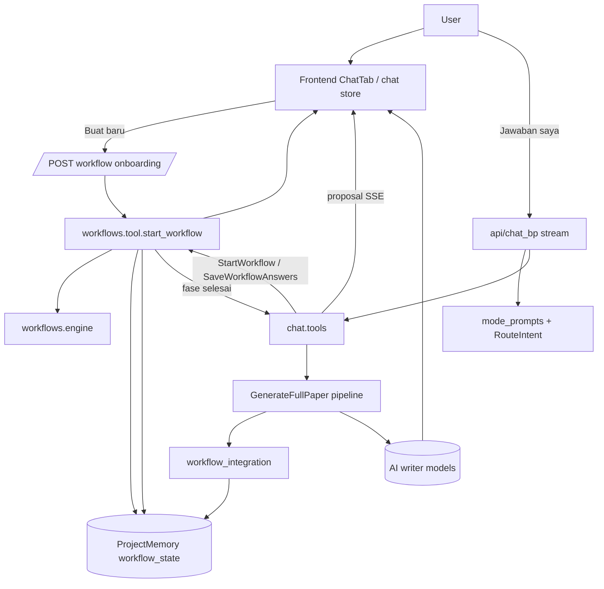

# Backend Workflows

Dokumen ini menjelaskan folder `backend/workflows` berdasarkan implementasi yang ada sekarang, bukan asumsi desain lama.

Fokus utama folder ini adalah workflow kuesioner untuk membangun paper dari nol, lalu menyerahkan hasilnya ke engine generator paper.

## Ringkasan Singkat

- Runtime workflow utama hidup di `engine.py` dan `tool.py`.
- Entry point ada dua:
  - lewat frontend tombol `Buat baru` -> endpoint REST onboarding offline
  - lewat chat AI mode `discovery` -> tool `StartWorkflow`
- State workflow disimpan di tabel `ProjectMemory` dengan key `workflow_state`.
- Jawaban yang disimpan adalah teks final manusiawi, bukan kode `A/B/C/D`.
- Pertanyaan statis tidak butuh AI.
- Pertanyaan `ai_generated` memanggil model chat untuk membuat opsi rekomendasi.
- Setelah fase selesai, workflow otomatis memicu pipeline `GenerateFullPaper`.
- Jawaban workflow kemudian disuntikkan lagi ke prompt generator paper lewat `paper_generation/workflow_integration.py`.

## Catatan Penting Soal Nama Fase

Komentar lama di beberapa file menyebut "9-phase workflow". Implementasi saat ini sebenarnya memakai indeks fase `0` sampai `9`.

Artinya ada 10 state implementasi:

1. Fase `0` = pre-questionnaire / status awal
2. Fase `1` sampai `8` = isi workflow utama
3. Fase `9` = validasi/finalisasi

Secara produk, ini tetap bisa dianggap "9 fase isi + 1 fase validasi" atau "10 state runtime". Untuk debugging, yang penting adalah indeks aktual di kode: `0..9`.

## Peta Folder

| Path | Peran |
|---|---|
| `engine.py` | Sumber kebenaran phase definition, branching, AI option generation, validasi, transisi fase |
| `tool.py` | Orkestrasi runtime workflow, persistence ke `ProjectMemory`, phase-2 pre-suggestions, answer resolution |
| `riset/` | File referensi lokal (`gatsbi1.txt`, `scite1.txt`); dari pembacaan repo ini tidak terlihat dipakai langsung oleh runtime backend |
| `terminal/` | Harness dan test manual/local untuk workflow; bukan jalur request produksi |
| `__init__.py` | Package marker |

Subfolder `terminal/` saat ini berisi helper dan test seperti:

- `chat_tester.py` untuk simulasi chat + tool loop lokal
- `run_conv.py` untuk menjalankan skenario percakapan terminal
- `test_full_workflow_e2e.py`, `test_fulltext.py`, `test_simple.py`, `test_workflow_comprehensive.py` untuk verifikasi perilaku workflow
- `IMPLEMENTATION_SUMMARY.md` sebagai catatan implementasi historis

## Aktor Runtime

Workflow ini sebenarnya bukan berdiri sendiri. Ia berada di tengah beberapa lapisan berikut:

1. Frontend chat
2. Endpoint onboarding REST
3. Chat router + mode prompt
4. Chat tool executor
5. Workflow engine
6. Persistence `ProjectMemory`
7. Paper generation pipeline

Secara praktis, pembagian tanggung jawabnya seperti ini:

| Komponen | Tanggung jawab |
|---|---|
| `frontend/src/components/ChatTab.vue` | Tombol awal `Buat baru` dan `Saya sudah punya draft` |
| `frontend/src/stores/chat.ts` | Render synthetic `multi_question`, kirim jawaban sebagai pesan user biasa, tangani SSE/proposal |
| `backend/api/workflow_bp.py` | Endpoint onboarding offline tanpa AI |
| `backend/api/chat_bp.py` | Streaming chat, route mode, eksekusi tool, kirim SSE `text/tool_call/tool_result/chips/open_tab` |
| `backend/chat/mode_prompts.py` | Menentukan mode, prompt sistem, dan subset tool yang boleh dipakai AI |
| `backend/chat/tools.py` | Mengeksekusi tool runtime termasuk `StartWorkflow`, `SaveWorkflowAnswers`, `GenerateFullPaper` |
| `backend/workflows/tool.py` | Menyimpan state workflow, memulai fase, menyelesaikan jawaban, memicu validasi/generate |
| `backend/workflows/engine.py` | Definisi fase, pertanyaan, cabang fase 6, AI option generation, validasi fase 9 |
| `backend/paper_generation/workflow_integration.py` | Mengubah `workflow_state` jadi blok konteks yang disisipkan ke prompt writer |

## Alur End-to-End



## Entry Point 1: `Buat baru` dari Frontend

Ini adalah jalur tercepat dan paling murah token.

### Apa yang terjadi

1. User klik chip `Buat baru` di chat.
2. Frontend memanggil `POST /api/papers/<paper_id>/workflow/onboarding`.
3. Endpoint `backend/api/workflow_bp.py`:
   - validasi JWT
   - validasi bahwa paper milik user
   - memanggil `workflows.tool.start_workflow(paper_id, user_id)`
4. `start_workflow()` mendeteksi state baru dan mengembalikan batch onboarding offline.
5. Frontend tidak menunggu AI. Ia langsung memanggil `injectMultiQuestion(proposal)`.
6. Card pertanyaan tampil sebagai synthetic assistant message.
7. Saat user submit, frontend mengubah jawaban menjadi teks biasa:

```text
Jawaban saya:
progress_level: A
data_readiness: B
team_size: A
...
```

8. Teks ini dikirim ke endpoint chat normal, lalu AI melanjutkan workflow dinamis.

### Kenapa disebut offline

Karena batch onboarding awal memakai pertanyaan statis yang seluruh opsinya sudah ada di `WORKFLOW_PHASES`. Tidak ada panggilan LLM untuk membuat opsi.

### Pertanyaan yang masuk onboarding offline

Onboarding offline saat fresh start mengambil 6 pertanyaan ini sekaligus:

- `0.1` `progress_level`
- `0.2` `data_readiness`
- `0.3` `team_size`
- `1.1` `field`
- `1.2` `paper_type`
- `1.3` `target_publication`

Setiap pertanyaan diberi opsi tambahan `Ceritakan sendiri...` dengan value yang tidak bentrok. Untuk field, value fallback bisa melewati `E` karena opsi field sudah memakai `A-N`.

### Default rekomendasi onboarding

Implementasi saat ini menandai default berikut sebagai `recommended`:

- `0.1 = A` `Masih ide/konsep`
- `0.2 = A` `Belum ada data`
- `0.3 = A` `Individu (tugas akhir)`
- `1.1 = A` `Ilmu Komputer & IT`
- `1.2 = B` `Research Paper`
- `1.3 = B` `Jurnal Sinta 2-6`

Ini hanya hint UI. User bebas mengganti.

## Entry Point 2: `StartWorkflow` lewat AI Chat

Mode `discovery` di `backend/chat/mode_prompts.py` menginstruksikan model untuk memanggil `StartWorkflow` ketika user ingin memulai paper dari nol, misalnya:

- `mulai dari 0`
- `mulai dari awal`
- `generate paper lengkap`
- `auto full paper`
- `paperfull`

Pada jalur ini AI lebih dulu masuk ke router `RouteIntent`, lalu pindah ke mode `discovery`, lalu baru boleh memakai `StartWorkflow`.

Secara aktual, baik jalur REST onboarding maupun tool `StartWorkflow` berakhir di fungsi yang sama: `workflows.tool.start_workflow()`.

## Mode Chat: Workflow Bisa Menanggapi Apa

Penting: folder `backend/workflows` sendiri tidak membaca bahasa natural secara langsung. Yang membaca intent user adalah lapisan chat di `backend/api/chat_bp.py` + `backend/chat/mode_prompts.py` + model AI.

Jadi, jawaban untuk pertanyaan "workflow bisa nanggepin apa" adalah: ia bisa ikut merespons semua intent yang diarahkan router ke mode yang sesuai, terutama `discovery`, tetapi juga hidup berdampingan dengan mode lain.

### Mode yang ada

| Mode | Dipakai untuk | Tool utama |
|---|---|---|
| `tier0` | klasifikasi awal intent | `RouteIntent` |
| `discovery` | bangun paper dari nol, workflow, penggalian fakta paper | `StartWorkflow`, `SaveWorkflowAnswers`, `AskQuestions`, `GenerateFullPaper`, `RunSLR`, `SetCitationStyle`, `SetLanguage`, dll |
| `slr` | literature review / search referensi | `RunSLR`, `SearchPapers`, `GetLiterature` |
| `edit` | edit paper yang sudah ada | `GetPaperSection`, `ProposeSection`, `ProposeAbstract`, dll |
| `rapikan` | renumber fig/table/eq | `GetPaperNumbering`, `ProposeSection` |
| `revisi` | revisi targeted setelah paper jadi | `Paraphrase`, `FixGrammar`, `Translate`, `ReviewPaper`, `ReviseData`, `AddLiterature` |
| `memory` | melihat / menghapus memory project | `ListMemory`, `DeleteMemory` |
| `casual` | percakapan biasa | tanpa tool |

### Intent yang secara praktis ditangani bersama workflow

| User bilang / klik | Lapisan yang menangani | Hasil |
|---|---|---|
| Klik `Buat baru` | Frontend + `/workflow/onboarding` | Card onboarding offline muncul tanpa AI |
| `Saya mau bikin paper dari awal` | `RouteIntent -> discovery` | AI boleh panggil `StartWorkflow` |
| `Jawaban saya: ...` saat workflow aktif | discovery mode | AI panggil `SaveWorkflowAnswers` |
| `Path A/B/C/D/E` | diinstruksikan oleh prompt discovery | model menafsirkan sebagai shorthand pilihan aktif |
| `Saya sudah punya draft` | discovery mode | skip onboarding offline, lanjut discovery bertahap |
| `Tolong carikan literatur` | `slr` atau discovery | `RunSLR` atau `SearchPapers` |
| `Generate paper lengkap` setelah data siap | discovery / revisi | `GenerateFullPaper` atau auto-generate setelah workflow complete |

## State yang Disimpan

Semua state workflow disimpan di `ProjectMemory` dengan key `workflow_state`.

Strukturnya seperti ini:

```json
{
  "current_phase": "2",
  "answers": {
    "field": "Ilmu Komputer & IT",
    "paper_type": "Research Paper",
    "target_publication": "Jurnal Sinta 2-6"
  },
  "pending_options": {
    "title": {
      "A": "Analisis ...",
      "B": "Implementasi ...",
      "C": "Evaluasi ...",
      "D": "Perbandingan ..."
    }
  }
}
```

### Arti masing-masing field

| Field | Fungsi |
|---|---|
| `current_phase` | fase aktif sekarang |
| `answers` | jawaban final yang sudah di-resolve ke teks manusiawi |
| `pending_options` | snapshot opsi dinamis terakhir yang sempat ditampilkan ke user |

### Kenapa perlu `pending_options`

Untuk pertanyaan statis, label bisa dicari lagi dari `WORKFLOW_PHASES` kapan pun.

Untuk pertanyaan AI-generated, label opsi mungkin hanya ada pada saat card itu dirender. Karena itu sistem menyimpan snapshot `{key: {value: label}}` agar jawaban `A/B/C/D` bisa diubah ke teks penuh saat user submit.

### Jawaban disimpan sebagai full text

`save_workflow_answers()` tidak menyimpan `A/B/C/D` mentah. Ia melakukan resolusi dengan urutan:

1. `pending_options` phase terakhir
2. opsi statis di `WORKFLOW_PHASES`
3. fallback ke teks mentah user jika itu free text

Ini penting karena prompt generator paper akhirnya menerima teks yang benar-benar bermakna, bukan kode huruf.

## Fase-Fase Workflow

## Fase 0 - Pre-Questionnaire / Status Awal

Tujuan: mengetahui status awal user sebelum masuk desain paper.

| ID | Key | Jenis | Keterangan |
|---|---|---|---|
| `0.1` | `progress_level` | statis | progress paper saat ini |
| `0.2` | `data_readiness` | statis | kesiapan data/eksperimen |
| `0.3` | `team_size` | statis | individu atau tim |

## Fase 1 - Profil Dasar Paper

Tujuan: identitas utama paper.

| ID | Key | Jenis | Keterangan |
|---|---|---|---|
| `1.1` | `field` | statis | bidang ilmu |
| `1.2` | `paper_type` | statis | literature review, research paper, case study, systematic review |
| `1.3` | `target_publication` | statis | target publikasi |
| `1.4` | `title` | AI-generated | judul provisional |

## Fase 2 - Topik dan Research Gap

Tujuan: mendefinisikan fokus riset.

| ID | Key | Jenis | Keterangan |
|---|---|---|---|
| `2.1` | `topic` | AI-generated | topik spesifik |
| `2.2` | `problem_statement` | AI-generated | problem statement |
| `2.3` | `research_gap` | AI-generated | gap riset |
| `2.4` | `research_questions` | AI-generated | research question |
| `2.5` | `objectives` | AI-generated | tujuan penelitian |
| `2.6` | `keywords` | AI-generated | kata kunci |

## Fase 3 - Metodologi dan Data

Tujuan: desain penelitian dan teknis data.

| ID | Key | Jenis |
|---|---|---|
| `3.1` | `methodology_approach` | statis |
| `3.2` | `specific_method` | AI-generated |
| `3.3` | `data_source` | AI-generated |
| `3.4` | `sample_size` | AI-generated |
| `3.5` | `tools` | AI-generated |
| `3.6` | `ethics` | statis |

## Fase 4 - Struktur dan Konten Paper

| ID | Key | Jenis |
|---|---|---|
| `4.1` | `template` | statis |
| `4.2` | `complexity` | statis |
| `4.3` | `section_count` | AI-generated |
| `4.4` | `priority_sections` | AI-generated |
| `4.5` | `outline` | AI-generated |

## Fase 5 - Literatur dan Sitasi

| ID | Key | Jenis |
|---|---|---|
| `5.1` | `citation_style` | statis |
| `5.2` | `reference_count` | statis |
| `5.3` | `key_papers` | AI-generated |
| `5.4` | `reference_years` | statis |
| `5.5` | `reference_tool` | statis |

## Fase 6 - Data dan Visualisasi (Branching)

Fase ini kondisional. Engine memilih satu cabang berdasarkan jawaban sebelumnya.

### Cabang quantitative

Aktif jika `methodology_approach` berisi salah satu dari:

- `A`
- `C`
- `Kuantitatif`
- `Mixed-Method`

Pertanyaannya:

- `6.1` `visualization_type`
- `6.2` `figure_count`
- `6.3` `data_format`
- `6.4` `visualization_platform`

### Cabang qualitative

Aktif jika `methodology_approach` berisi salah satu dari:

- `B`
- `Kualitatif`

Pertanyaannya:

- `6.1` `visualization_type`
- `6.2` `figure_count`
- `6.3` `coding_framework`
- `6.4` `visualization_platform`

### Cabang literature

Aktif jika `paper_type` berisi salah satu dari:

- `A`
- `D`
- `Literature Review`
- `Systematic Review`

Pertanyaannya:

- `6.1` `visualization_type`
- `6.2` `figure_count`
- `6.3` `screening_strategy`
- `6.4` `visualization_platform`

### Default branch

Kalau tidak ada condition yang match, engine default ke cabang `quantitative`.

## Fase 7 - Output dan Preferensi Penulisan

| ID | Key | Jenis |
|---|---|---|
| `7.1` | `language` | statis |
| `7.2` | `writing_tone` | statis |
| `7.3` | `voice_style` | statis |
| `7.4` | `priority` | statis |
| `7.5` | `plagiarism_check` | statis |

## Fase 8 - Supplementary dan Production Readiness

| ID | Key | Jenis |
|---|---|---|
| `8.1` | `authors` | statis |
| `8.2` | `statements` | statis |
| `8.3` | `budget` | AI-generated |
| `8.4` | `timeline` | statis |
| `8.5` | `reviewer` | statis |
| `8.6` | `final_format` | statis |

## Fase 9 - Validasi dan Finalisasi

Tidak ada pertanyaan baru. Engine menjalankan cross-check konsistensi.

## Kapan AI Dipanggil dan Kapan Tidak

### Tidak memanggil AI

Bagian berikut berjalan penuh secara lokal:

- onboarding offline fase 0 + 1.1-1.3
- penambahan opsi free text `Ceritakan sendiri...`
- resolusi label pertanyaan statis
- pemilihan branch fase 6
- penyimpanan state workflow
- perhitungan next phase `0 -> 1 -> 2 -> ... -> 9`
- validasi fase 9
- generation executive summary

### Memanggil AI

AI dipanggil pada 4 lapisan berbeda:

1. chat router / mode reasoning
2. pembangkitan opsi pertanyaan dinamis
3. pre-suggestion khusus fase 2
4. generator paper setelah workflow selesai

## AI Call 1 - Chat Router dan Discovery Agent

`backend/api/chat_bp.py` mengirim pesan user + system prompt mode + subset tool ke upstream chat model.

Tujuan lapisan ini:

- mengklasifikasikan intent lewat `RouteIntent`
- memutuskan kapan memanggil `StartWorkflow`
- memutuskan kapan memanggil `SaveWorkflowAnswers`
- memutuskan kapan memakai `AskQuestions`
- memutuskan kapan workflow sudah cukup untuk generate paper

Event yang di-stream ke frontend selama proses ini:

- `text`
- `thinking`
- `tool_call`
- `tool_result`
- `chips`
- `open_tab`
- `done`
- `error`

## AI Call 2 - `generate_ai_options()`

Fungsi ini dipakai untuk semua pertanyaan `ai_generated` di `engine.py`.

### Trigger

Dipanggil oleh `get_phase_questions(phase, previous_answers)` ketika sebuah question punya flag `ai_generated=True`.

### Input yang dikirim ke AI

Sistem mengirim dua message ke endpoint `AIOTOMASI_API/chat/completions`:

- system prompt: instruksi untuk membuat 4 rekomendasi akademik yang spesifik, berbeda, 5-15 kata, output JSON array of strings
- user prompt: berisi
  - `Question`
  - `Question ID`
  - `Question key`
  - `Previous answers` hanya dari key yang ada di `depends_on`

Contoh bentuk konteks yang dikirim:

```text
Question: Topik spesifik?
Question ID: 2.1
Question key: topic

Previous answers:
- 1.1: Ilmu Komputer & IT
- 1.4: Analisis ...
```

### Konfigurasi model

- endpoint: `AIOTOMASI_API/chat/completions`
- auth: `AIOTOMASI_APIKEY`
- model: `MODELCHAT` atau default `VIOLA-CHAT`
- `stream = false`
- `max_tokens = 500`
- `temperature = 0.7`

### Output yang diharapkan

Model harus mengembalikan JSON array 4 string, misalnya:

```json
["Rekomendasi 1", "Rekomendasi 2", "Rekomendasi 3", "Rekomendasi 4"]
```

### Hardening dan fallback

- `_extract_json_array()` mencoba parse output walau dibungkus:
  - fenced code block
  - `<think>...</think>`
  - teks lain di sekitar array
- jika API/env gagal, engine fallback ke `_get_fallback_options()`
- fallback ini bersifat question-specific untuk banyak ID penting seperti `1.4`, `2.1`, `3.2`, `4.5`, `8.3`, dll

## AI Call 3 - `_generate_phase2_suggestions()`

Ini adalah optimisasi khusus saat masuk fase `2`.

### Tujuan

Sebelum user melihat fase 2, sistem mencoba menyiapkan rekomendasi topik yang lebih tajam memakai profil user dari fase awal.

### Trigger

Dipanggil di `start_workflow()` hanya jika `current_phase == "2"`.

### Input yang dikirim ke AI

Profil yang dikompilasi dari jawaban sebelumnya:

- `field`
- `paper_type`
- `target_publication`
- `title`

System prompt meminta AI mengembalikan JSON dengan format persis:

```json
{
  "topics": [
    {"topic": "...", "problem": "...", "gap": "..."}
  ]
}
```

Rule penting yang diminta ke model:

- tepat 4 entri
- bahasa Indonesia formal akademik
- setiap field maksimal 80 karakter
- topik harus berbeda satu sama lain

### Output dipakai untuk apa

Kalau berhasil, hasilnya dipetakan ke tiga key awal fase 2:

- `topic`
- `problem_statement`
- `research_gap`

Jika gagal, runtime tetap jalan karena masing-masing question `ai_generated` masih bisa memakai `generate_ai_options()` atau fallback lokal.

## AI Call 4 - Generate Paper Setelah Workflow Selesai

Begitu `save_workflow_answers()` mencapai fase `9`, ia mengembalikan `workflow_validation`.

Lalu wrapper chat tool `_save_workflow_answers()` melakukan hal berikut:

1. membaca seluruh `workflow_state`
2. memilih prompt generasi utama dari prioritas:
   - `title`
   - atau `topic`
   - atau `field`
3. memanggil `_generate_full_paper(...)`
4. mengemas hasil sebagai proposal `workflow_complete_generating`

### Guard sebelum generate

`_generate_full_paper()` melakukan pre-flight:

- butuh `AIOTOMASI_APIKEY`
- cek lock paper agar tidak generate ganda
- cek jumlah literature item

Kalau literatur `< 20` dan tidak ada `must_read`, tool tidak langsung generate. Ia mengembalikan proposal `validation_error` dengan kode `NEED_MORE_LITERATURE`.

### Apa yang dibawa ke writer pipeline

Pipeline generation menggabungkan beberapa blok:

- project memory
- literature catalog
- outline planner result
- output settings
- workflow context dari `workflow_state`

`workflow_state` dimuat oleh `paper_generation/workflow_integration.py` dan diubah menjadi blok seperti:

- research field
- paper type
- research questions
- methodology approach
- specific method
- sample size
- data source
- target reference count
- target publication
- writing tone
- citation style
- ethics
- budget
- timeline

Blok ini lalu disuntikkan di generator:

- `paper_generation/chunked.py` pada outline generation dan section generation
- `paper_generation/single.py` pada single-shot generation

## Kontrak Data antara Workflow dan Frontend

Workflow tidak langsung mengirim HTML/UI. Ia mengirim payload proposal yang dibaca frontend.

### Sentinel proposal

`backend/chat/tools.py` membungkus proposal dengan prefix:

```text
<<PROPOSAL>>
```

Frontend `chat.ts` memeriksa prefix ini pada `tool_result`, lalu mengubahnya menjadi metadata UI.

### Jenis proposal workflow yang penting

| `kind` | Arti di frontend |
|---|---|
| `multi_question` | render `MultiQuestionCard` |
| `workflow_complete_generating` | tampilkan ringkasan validasi dan status generate paper |
| `validation_error` | tampilkan warning, misalnya literatur belum cukup |
| `chips` | render chip suggestion |

### Payload `multi_question`

Bentuk umumnya:

```json
{
  "kind": "multi_question",
  "phase": "2",
  "phase_name": "Topik & Research Gap",
  "description": "...",
  "questions": [
    {
      "id": "2.1",
      "key": "topic",
      "label": "[2.1] Topik spesifik?",
      "options": [
        {"label": "...", "value": "A"}
      ]
    }
  ]
}
```

Frontend menyimpannya sebagai `metadata.kind = 'multi_question'`, lalu saat user submit jawaban, store mengirimkan satu pesan user biasa.

## Tool yang Langsung Berhubungan dengan Workflow

### `RouteIntent`

Tool klasifikasi mode. Ia tidak memodifikasi workflow, tetapi menentukan apakah user akan diarahkan ke mode `discovery` yang punya akses ke tool workflow.

### `StartWorkflow`

Wrapper chat yang memanggil `workflows.tool.start_workflow()` lalu mengembalikan proposal `multi_question`.

Catatan penting:

- deskripsi schema di `CHAT_TOOLS` masih menyebut "batch pertama 3 pertanyaan"
- implementasi aktual fresh-start sekarang mengembalikan 6 pertanyaan onboarding offline sekaligus

### `SaveWorkflowAnswers`

Wrapper chat yang:

1. mengambil `current_phase` dari `workflow_state`
2. mengirim jawaban ke `save_workflow_answers()`
3. bila masih lanjut, memanggil `start_workflow()` lagi untuk fase berikutnya
4. bila sudah final, otomatis memicu `GenerateFullPaper`

### `AskQuestions`

Ini bukan engine workflow inti, tetapi dipakai mode discovery untuk fact gathering non-card atau follow-up conversational question.

Constraint schema saat ini:

- maksimal 3 question
- setiap question harus punya tepat 4 opsi

### `GenerateFullPaper`

Bukan bagian workflow folder, tetapi ini adalah handoff terakhir workflow ke writer pipeline.

## Fungsi-Fungsi Kunci di `workflows/tool.py`

### `start_workflow(paper_id, user_id)`

Tanggung jawab:

- load state lama kalau ada
- kalau fresh start, kirim onboarding offline
- untuk fase biasa, ambil pertanyaan yang belum dijawab
- kalau fase 2, injeksikan phase-2 suggestions
- snapshot opsi dinamis ke `pending_options`
- return payload `multi_question`

### `_snapshot_options(formatted_questions)`

Menyimpan hanya opsi dinamis, bukan opsi statis. Tujuan utamanya hemat token dan hemat storage.

### `_resolve_answer_text(...)`

Mengubah jawaban `A/B/C/D` menjadi teks label penuh.

Ini penting untuk:

- readability state
- branch condition yang tetap kompatibel
- prompt generation yang lebih bermakna

### `save_workflow_answers(...)`

Tanggung jawab:

- baca state lama
- resolve jawaban ke full text
- merge ke `answers`
- hitung next phase
- kalau fase 9 tercapai, panggil `validate_workflow()`

### `jump_to_phase(...)`

Helper untuk backward adjustment. Ia bisa menyiapkan kembali pertanyaan fase tertentu dan menyimpan snapshot opsi.

Saat pembacaan ini, helper ini ada di modul tetapi belum diekspos sebagai tool chat publik di bundle utama.

### `get_validation_with_phase_links(...)`

Menambahkan mapping warning -> related phase -> adjustment action.

Helper ini juga tampak siap untuk UX backward adjustment, tetapi belum menjadi jalur tool publik standar di chat bundle yang terbaca sekarang.

## Fungsi-Fungsi Kunci di `workflows/engine.py`

### `get_phase_questions(phase, previous_answers)`

Inilah pintu utama pembentukan pertanyaan per fase.

Yang dilakukan:

- memilih branch fase 6 bila perlu
- untuk pertanyaan `ai_generated`, memanggil `generate_ai_options()`
- menambahkan opsi free-text `Ceritakan sendiri...`

### `resolve_static_label(key, value)`

Lookup global untuk pertanyaan statis lintas fase. Dipakai terutama saat jawaban datang dari onboarding gabungan yang mencampur fase 0 dan fase 1.

### `_compute_static_option_keys()`

Menghitung seluruh key pertanyaan statis sekali saat import. Daftar ini dipakai agar snapshot `pending_options` tidak membengkak oleh opsi yang sebenarnya bisa direkonstruksi kapan saja.

### `validate_workflow(answers)`

Menjalankan validasi fase 9.

Check yang saat ini ada:

1. `RQ vs Metode`
2. `Sampel vs Metode`
3. `Sitasi vs Target`
4. `Tone vs Target`
5. `Etika vs Subjek`
6. `Anggaran vs Target`
7. `Timeline vs Kompleksitas`

Outputnya:

- `valid`
- `warnings`
- `summary`

### `generate_executive_summary(answers)`

Menyusun ringkasan singkat untuk status final workflow, termasuk checklist area yang sudah terisi.

### `get_next_phase(current_phase, answers)`

Saat ini transisi fase masih linear:

```text
0 -> 1 -> 2 -> 3 -> 4 -> 5 -> 6 -> 7 -> 8 -> 9
```

Belum ada lompat fase berbasis isi jawaban selain branching internal di fase 6.

## Detail Respons System terhadap Hasil Tool

Di `backend/api/chat_bp.py`, setiap tool result diproses dua arah:

1. dikirim ke frontend via SSE sebagai `tool_result`
2. dikirim balik ke model sebagai `role=tool` dengan versi hasil yang sudah diringkas

Ini penting untuk memahami "kirim ke AI apa ketika apa".

### Contoh perilaku

#### Jika tool menghasilkan proposal

Frontend menerima raw proposal lengkap agar bisa render UI.

Tetapi upstream model tidak selalu menerima proposal JSON mentah. Untuk beberapa tool, hasilnya disanitasi agar model tidak bingung.

Contoh:

- `GenerateFullPaper` -> model diberi kalimat ringkas bahwa job generation sudah dimulai
- `RunSLR` -> model diberi kalimat ringkas bahwa SLR job queued dan literature tab akan terisi
- proposal lain -> model diberi ringkasan `Proposal recorded. The user will review and accept/reject in the Preview tab.`

#### Jika tool adalah `RouteIntent`

Hasil route tidak diperlakukan seperti tool biasa. Backend mengganti mode conversation, rebuild system prompt, lalu memanggil upstream lagi dengan bundle tool baru.

## Yang Dikirim ke AI pada Setiap Tahap

Bagian ini merangkum payload secara mental model.

### Tahap A - user baru mulai

- jika lewat tombol `Buat baru`: tidak kirim apa-apa ke AI untuk batch onboarding awal
- jika lewat chat biasa: user message dikirim ke chat model tier0, model diminta klasifikasi `RouteIntent`

### Tahap B - user mengisi pertanyaan dinamis

Engine mengirim ke `MODELCHAT`:

- question text
- question id
- question key
- previous answers dari dependency terkait

Output yang diharapkan: 4 opsi rekomendasi

### Tahap C - user submit jawaban

Frontend hanya mengirim teks `Jawaban saya:\nkey: value`.

Model discovery lalu memutuskan:

- panggil `SaveWorkflowAnswers`
- atau jika perlu, lanjut `AskQuestions`

### Tahap D - workflow complete

Wrapper workflow mengirim ke pipeline generate:

- prompt inti: prioritas `title -> topic -> field`
- memory block
- literature block
- outline planner
- workflow context
- output settings

### Tahap E - writer stage

Generator section/outline menerima blok workflow context yang sudah diformat, sehingga model penulis tahu:

- jenis paper
- metode
- target publikasi
- tone
- style sitasi
- batasan etika/timeline/budget

## Mismatch Kecil yang Perlu Diketahui

Ada beberapa tempat di kode/prompt yang secara semantik sudah sedikit tertinggal dibanding perilaku runtime sekarang:

1. `StartWorkflow` schema description masih menyebut batch pertama 3 pertanyaan, padahal fresh onboarding aktual mengirim 6 pertanyaan statis sekaligus.
2. Prompt discovery berkali-kali menekankan `AskQuestions` 3 pertanyaan per batch, tetapi `start_workflow()` sendiri bisa mengirim lebih dari 3 question dalam satu proposal karena ia mengambil semua pertanyaan fase yang belum terjawab.
3. Dokumentasi lama menyebut 9 fase, tetapi runtime memakai state `0..9`.

Ini bukan berarti sistem rusak, tetapi penting untuk debugging kalau perilaku UI terlihat berbeda dari komentar atau prompt lama.

## Ringkasan Praktis

Kalau disederhanakan, `backend/workflows` melakukan 5 hal inti:

1. mendefinisikan seluruh pertanyaan dan branch workflow
2. memutuskan pertanyaan mana yang statis dan mana yang perlu AI
3. menyimpan jawaban user dalam bentuk teks penuh yang siap dipakai ulang
4. memvalidasi konsistensi desain paper
5. menyerahkan hasil akhir ke engine generator paper

Kalau Anda ingin debug alur ini, urutan file paling penting untuk dibaca adalah:

1. `backend/workflows/engine.py`
2. `backend/workflows/tool.py`
3. `backend/chat/mode_prompts.py`
4. `backend/chat/tools.py`
5. `backend/api/chat_bp.py`
6. `backend/paper_generation/workflow_integration.py`