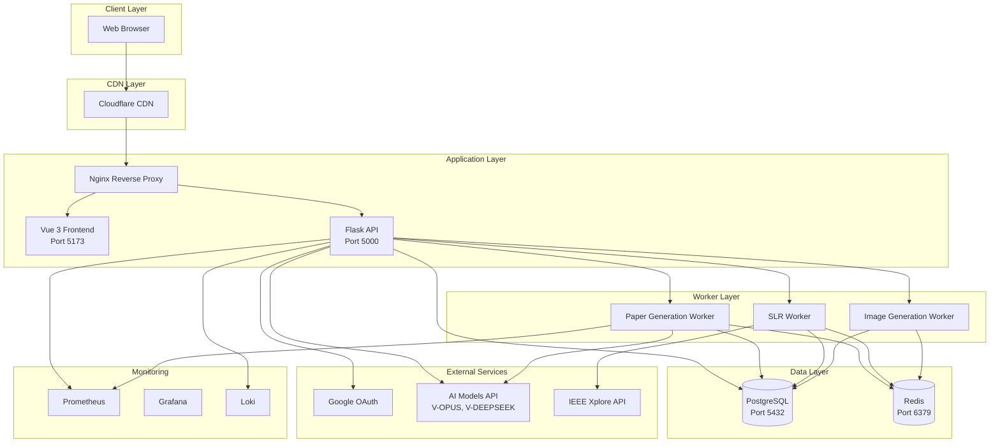
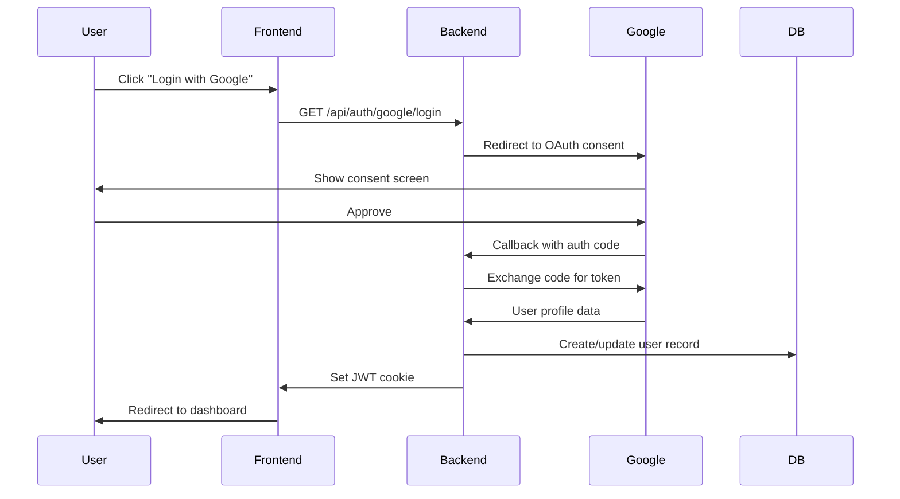
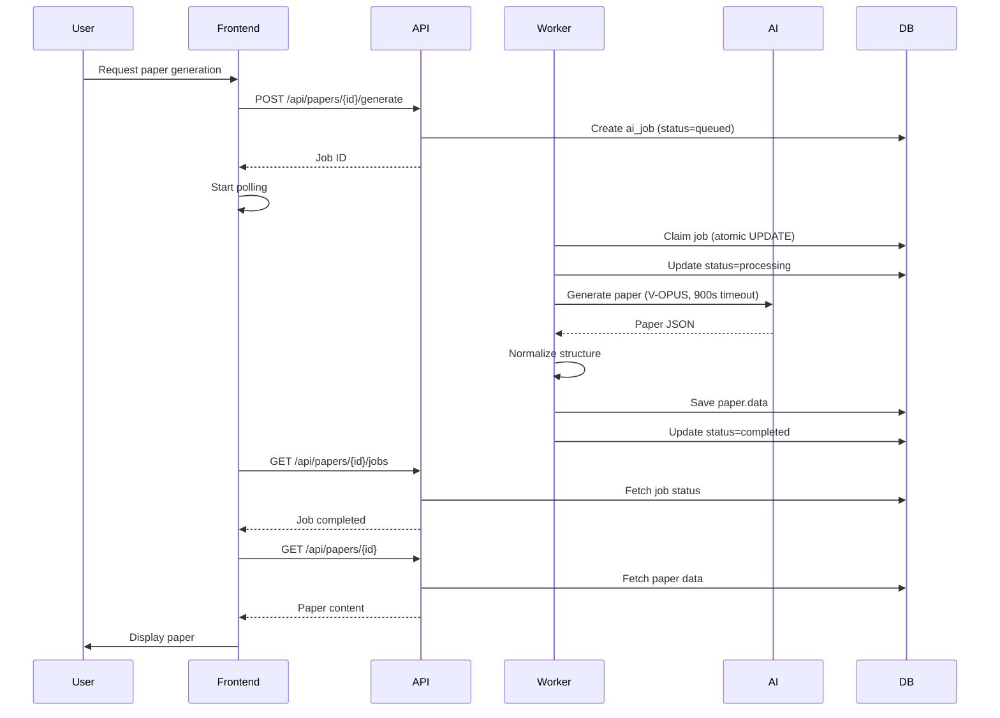
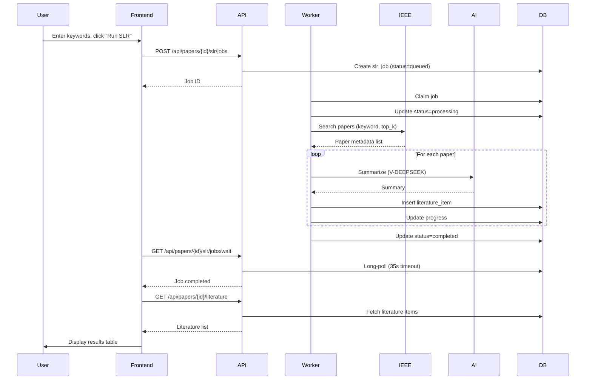
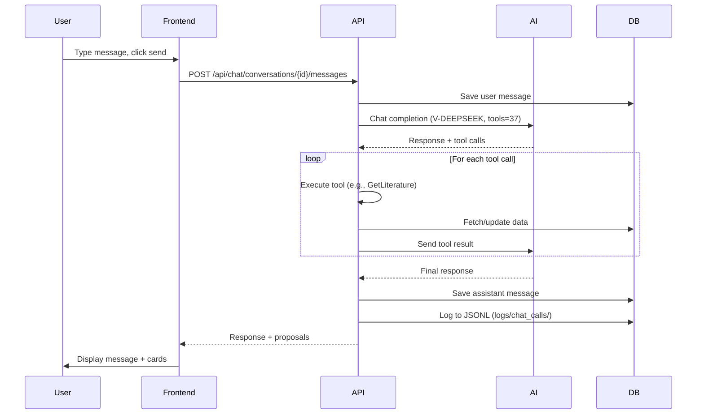

# System Overview

## Introduction

PaperFull is an AI-powered academic paper generation platform that helps researchers, students, and academics create high-quality research papers through an intelligent chat interface. The system combines AI language models, systematic literature review capabilities, and automated formatting to streamline the paper writing process.

**Key Capabilities:**
- AI-assisted paper generation (single-shot and iterative)
- Systematic Literature Review (SLR) automation
- Interactive chat interface with multi-question workflows
- Citation management and formatting
- Chart and image generation
- Multiple export formats (DOCX, PDF)

**Production URL**: https://paperfull.app

## High-Level Architecture



## Core Components

### 1. Frontend (Vue 3 SPA)

**Technology**: Vue 3, Vite, Pinia, Vue Router, TailwindCSS

**Responsibilities**:
- User interface and interaction
- Real-time chat with AI
- Paper editor and preview
- File upload handling
- State management (Pinia stores)
- Routing and navigation

**Key Files**:
- `frontend/src/views/` - Page components
- `frontend/src/components/` - Reusable components
- `frontend/src/stores/` - Pinia state stores
- `frontend/src/api/` - API client

**Build Output**: Static files served by Nginx or PM2

### 2. Backend API (Flask)

**Technology**: Flask, SQLAlchemy, Flask-JWT-Extended, Alembic

**Responsibilities**:
- REST API endpoints
- Authentication & authorization (Google OAuth + JWT)
- Business logic orchestration
- Database operations
- Job queue management
- Rate limiting and quotas

**Key Modules**:
- `backend/app.py` - Main Flask application
- `backend/auth.py` - Authentication logic
- `backend/chat.py` - Chat API (model: V-DEEPSEEK)
- `backend/chat_tools.py` - 37 chat tools
- `backend/slr_bp.py` - SLR endpoints
- `backend/charts_bp.py` - Chart generation endpoints
- `backend/files_bp.py` - File upload endpoints
- `backend/models.py` - SQLAlchemy models

**API Server**: Gunicorn (production) or Flask dev server (development)

### 3. Workers (Async Task Processors)

**Technology**: Python, Redis Queue (RQ)

#### Paper Generation Worker
- Generates complete papers using V-OPUS model
- Single-shot generation (replaces chunked approach)
- Processes prompts, literature, and chat history
- Timeout: 900s (15 minutes)
- Output: Structured JSON paper data

#### SLR Worker
- Executes Systematic Literature Review
- Searches IEEE Xplore and other sources
- AI summarization using V-DEEPSEEK
- Parallel processing (max 10 workers)
- Stores results in `literature_items` table

#### Image Generation Worker
- Generates images using Gemini API
- Compresses and optimizes images
- Atomic job claiming (prevents race conditions)
- Stores in `paper_images` table

**Process Management**: PM2 (`paper-worker` process)

### 4. Database (PostgreSQL)

**Version**: PostgreSQL 14+

**Key Tables** (13 total):
- `users` - User accounts (Google OAuth)
- `papers` - Paper documents and metadata
- `conversations` - Chat conversations
- `chat_messages` - Chat message history
- `ai_jobs` - Paper generation jobs
- `slr_jobs` - SLR execution jobs
- `image_gen_jobs` - Image generation jobs
- `literature_items` - SLR results
- `paper_files` - Uploaded files
- `paper_images` - Generated images
- `project_memory` - AI memory storage
- `api_usage_logs` - API usage tracking
- `alembic_version` - Migration version

**Migration Tool**: Alembic

**Connection**: SQLAlchemy ORM

### 5. Cache & Queue (Redis)

**Version**: Redis 7+

**Usage**:
- Job queue for workers (RQ)
- Session storage
- Rate limiting counters
- Temporary data caching

**Persistence**: RDB snapshots + AOF

### 6. External Services

#### Google OAuth
- User authentication
- Profile information (email, name, picture)
- OAuth 2.0 flow

#### AI Models API (AIOTOMASI)
- **V-OPUS**: Paper generation (high quality, slow)
- **V-DEEPSEEK**: Chat & SLR (fast, cost-effective)
- Model lock: No user selection, hard-coded per use case

#### IEEE Xplore API
- Academic paper search
- Metadata retrieval
- Optional (requires API key)

### 7. Monitoring Stack

#### Prometheus
- Metrics collection
- Time-series database
- Alert rules

#### Grafana
- Metrics visualization
- Dashboards
- Alert notifications

#### Loki
- Log aggregation
- Log querying
- Integration with Grafana

## Key Workflows

### 1. User Authentication Flow



### 2. Paper Generation Flow (Single-Shot)



### 3. SLR Execution Flow



### 4. Chat Interaction Flow



## Technology Stack

### Backend
- **Language**: Python 3.10+
- **Framework**: Flask 3.1.0
- **ORM**: SQLAlchemy 3.1+
- **Migration**: Alembic 1.13
- **Auth**: Flask-JWT-Extended, Authlib (OAuth)
- **Queue**: Redis Queue (RQ)
- **Server**: Gunicorn 23.0
- **Testing**: Pytest, Playwright

### Frontend
- **Language**: JavaScript (ES6+)
- **Framework**: Vue 3.5
- **Build Tool**: Vite 6.1
- **State**: Pinia 2.3
- **Router**: Vue Router 4.5
- **Styling**: TailwindCSS 3.4
- **HTTP**: Axios 1.7
- **Markdown**: Marked 18.0
- **Math**: KaTeX 0.16
- **Testing**: Vitest, Playwright

### Database
- **RDBMS**: PostgreSQL 14+
- **Cache**: Redis 7+

### Infrastructure
- **Process Manager**: PM2
- **Web Server**: Nginx
- **CDN**: Cloudflare
- **Monitoring**: Prometheus, Grafana, Loki
- **OS**: Linux (Ubuntu/Debian)

### External APIs
- **AI Models**: AIOTOMASI API (V-OPUS, V-DEEPSEEK)
- **OAuth**: Google OAuth 2.0
- **Literature**: IEEE Xplore API (optional)

## Deployment Architecture

**Production Server**: Single VPS (scalable to multi-server)

**Process Management**:
```
PM2 Processes:
├── paper-frontend  (serve dist/)
├── paper-backend   (gunicorn app:app)
└── paper-worker    (python worker.py)
```

**Port Allocation**:
- Frontend: 5173 (dev) / served by Nginx (prod)
- Backend: 5000 (internal)
- PostgreSQL: 5432
- Redis: 6379
- Prometheus: 9090
- Grafana: 3000

**Nginx Configuration**:
- Reverse proxy to backend API
- Static file serving (frontend dist/)
- SSL/TLS termination
- Rate limiting
- Gzip compression

**Domain**: paperfull.app (Cloudflare DNS + CDN)

## Security

### Authentication
- Google OAuth 2.0 for user login
- JWT tokens for API authentication
- HTTP-only cookies for token storage
- CSRF protection

### Authorization
- User-based access control
- Paper ownership validation
- API rate limiting (Flask-Limiter)
- Token expiration and refresh

### Data Protection
- PostgreSQL connection encryption
- Environment variable secrets
- No secrets in code or logs
- Regular backups

### Network Security
- HTTPS only (Cloudflare SSL)
- CORS configuration
- Security headers (Nginx)
- DDoS protection (Cloudflare)

## Scalability

### Current Capacity
- Single server deployment
- ~100 concurrent users
- ~10 parallel SLR workers
- ~5 paper generation jobs/minute

### Scaling Strategy

**Horizontal Scaling**:
- Add more worker processes (PM2 cluster mode)
- Separate worker servers
- Load balancer (Nginx/HAProxy)
- Database read replicas

**Vertical Scaling**:
- Increase server resources (CPU, RAM)
- Optimize database queries
- Redis caching layer
- CDN for static assets

**Bottlenecks**:
- AI API rate limits (external)
- Database connections (configurable)
- Worker concurrency (Redis queue)

## Performance

### Response Times (Target)
- Page load: < 2s
- API response: < 500ms
- Chat response: < 5s (AI dependent)
- Paper generation: 2-5 minutes (V-OPUS)
- SLR execution: 1-3 minutes (20 papers)

### Optimization Techniques
- Frontend code splitting (Vite)
- API response caching (Redis)
- Database query optimization (indexes)
- Long-polling for job status (reduces requests)
- Lazy loading (Vue components)

## Monitoring & Observability

### Metrics (Prometheus)
- Request rate, latency, errors
- Worker queue depth
- Database connection pool
- AI API usage and costs
- User activity

### Logs (Loki)
- Application logs (backend/app.log)
- Worker logs
- Nginx access/error logs
- Chat call logs (JSONL)

### Alerts
- High error rate
- Worker queue backup
- Database connection exhaustion
- Disk space low
- SSL certificate expiration

## Related Documentation

- [Component Diagram](component-diagram.md) - Detailed component interactions
- [Data Flow](data-flow.md) - Sequence diagrams for key workflows
- [Database Schema](database-schema.md) - Complete database structure
- [Deployment Architecture](deployment-architecture.md) - Production setup details
- [Tech Stack](tech-stack.md) - Technology choices and rationale

---

**Last Updated**: 2026-05-22  
**Reviewed By**: Tech Team  
**Next Review**: 2026-06-22
